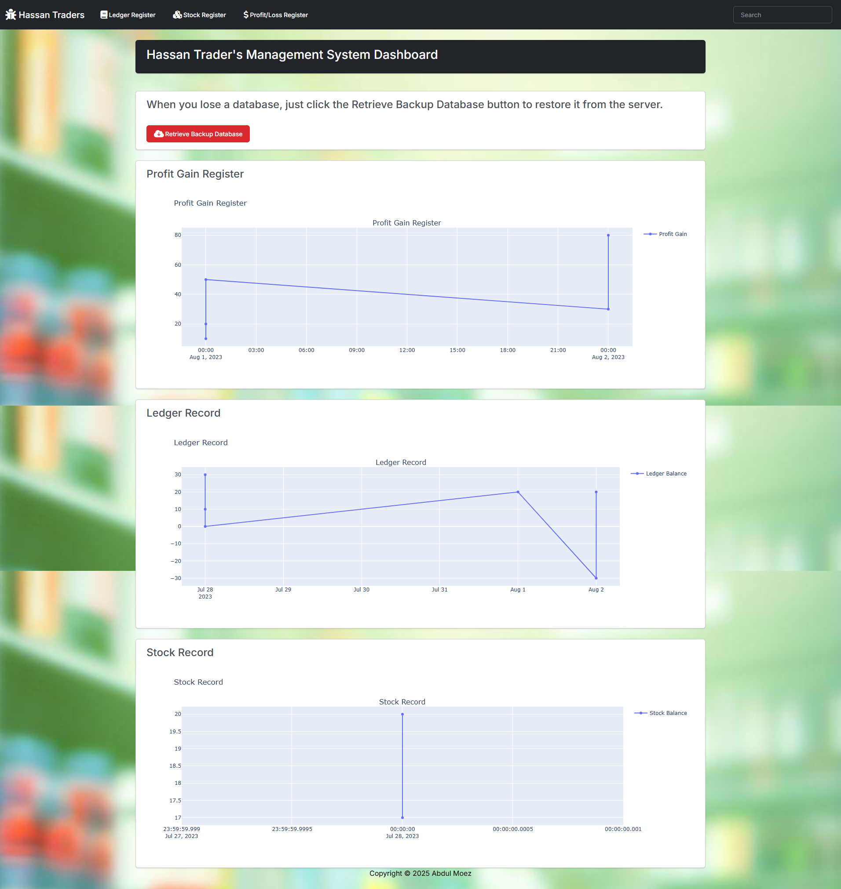
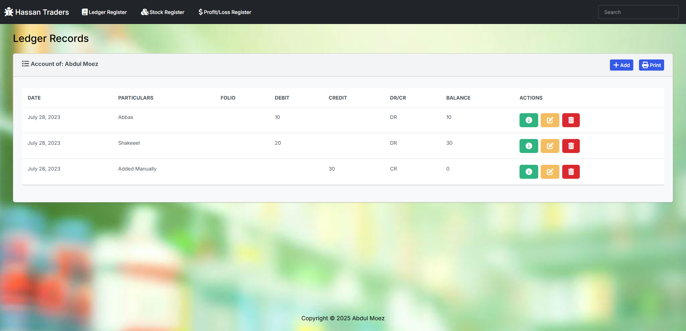
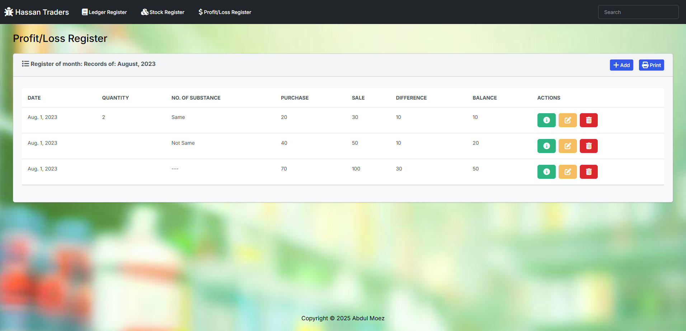
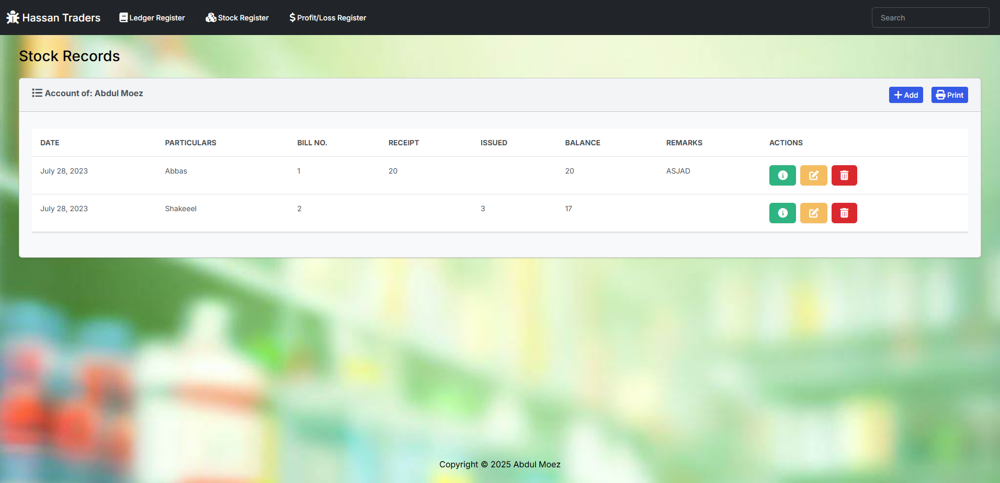

# Hassan Traders Management System 📊🛠️

> **A full‑stack Django 5.2 web‑application for Ledger Accounting, Stock Inventory & Profit/Loss analytics with 
> real‑time off‑site backups to Firebase and interactive Plotly dashboards.**
>
> Keywords: **Django accounting software**, **stock management webapp**, **ledger register**, **profit loss tracker**,
> **Firebase realtime database backup**, **background task scheduler**, **Plotly business dashboard**

[](https://www.python.org/)  [](https://docs.djangoproject.com/en/5.2/)  [](LICENSE)

---

## 📑 Table of Contents

1. [Live Demo](#-live-demo)
2. [Project Highlights](#-project-highlights)
3. [Screenshots](#-screenshots)
4. [Quick Start (TL;DR)](#-quick-start-tldr)
5. [Full Installation Guide](#-full-installation-guide)

   * [Prerequisites](#prerequisites)
   * [Clone & Virtual Env](#clone--virtual-env)
   * [Install Dependencies](#install-dependencies)
   * [Database Migrations](#database-migrations)
   * [Create Admin Account](#create-admin-account)
   * [Firebase Realtime Backup (optional)](#firebase-realtime-backup-optional)
   * [Run Local Server + Background Worker](#run-local-server--background-worker)
6. [Application Walk‑Through](#-application-walk-through)
7. [Configuration Reference](#-configuration-reference)
8. [Deployment Checklist](#-deployment-checklist)
9. [Troubleshooting FAQ](#-troubleshooting-faq)
10. [Contributing 🤝](#-contributing-)
11. [License 📝](#-license-)
12. [Author & Support](#-author--support)

---

## Live Demo

> Coming soon – deploy your own instance by following the **[Deployment Checklist](#-deployment-checklist)**.

---

## ✨ Project Highlights

* **Triple‑entry bookkeeping** with dedicated modules for **Ledger**, **Stock** and **Profit/Loss**.
* **Plotly dashboards** give instant visual insight into balances and trends.
* **Real‑time cloud backups** – every minute a **background\_task** worker syncs data to **Firebase Realtime Database** (configurable).
* **Offline‑first safety** – retrieve the entire DB back from Firebase with one click when disaster strikes.
* **Bootstrap 5 UI** with dark navbar, responsive tables, modal CRUD forms & print‑ready reports.
* **SEO‑friendly** URL structure and keyword‑rich pages for GitHub & search visibility.
* **100 % Python** – no JavaScript build toolchain required; uses vanilla JS for helper scripts only.

---

## 🖼️ Screenshots

|                                             Home Dashboard                                             |                                 Ledger Register                                 |                                      Profit/Loss Register                                     |                                 Stock Register                                |
| :----------------------------------------------------------------------------------------------------: | :-----------------------------------------------------------------------------: | :-------------------------------------------------------------------------------------------: | :---------------------------------------------------------------------------: |
|  |  |  |  |


---

## ⚡ Quick Start (TL;DR)

```bash
# 1. Clone & enter project
$ git clone https://github.com/Anonym0usWork1221/hassan-traders.git
$ cd hassan‑traders

# 2. Create a Python 3.11 virtual env & activate
$ python -m venv .venv
$ source .venv/bin/activate  # Windows: .venv\Scripts\activate

# 3. Install requirements
$ pip install -r requirements.txt

# 4. Apply DB migrations & create an admin
$ python manage.py migrate
$ python manage.py createsuperuser

# 5. (Option) drop your Firebase key at static/google-services.json & set the URL

# 6. Start background worker (terminal 1)
$ python manage.py process_tasks

# 7. Run dev server (terminal 2)
$ python manage.py runserver

# 8. Open 📟 http://127.0.0.1:8000/ and enjoy.
```

Voilà you have a fully‑functional accounting & inventory system on your laptop! 🎉

---

## 🛠️ Full Installation Guide

### Prerequisites

| Tool               | Version                           | Install                                                                |
| ------------------ | --------------------------------- | ---------------------------------------------------------------------- |
| Python             | **3.10 – 3.12** (tested 3.11)     | [https://www.python.org/downloads/](https://www.python.org/downloads/) |
| Git                | latest                            | [https://git‑scm.com/downloads](https://git‑scm.com/downloads)         |
| (optional) Node.js | for Nginx‑compressed static build | [https://nodejs.org/](https://nodejs.org/)                             |

> **Tip:** On Windows, we recommend **WSL 2** or Git Bash for smoother Unix‑like commands.

### Clone & Virtual Env

```bash
$ git clone https://github.com/Anonym0usWork1221/hassan-traders.git
$ cd hassan‑traders
$ python -m venv .venv && source .venv/bin/activate
```

### Install Dependencies

All required packages are pinned in **`requirements.txt`**.

```bash
$ pip install -r requirements.txt
```

#### Key Libraries

* **Django 5.2** – the web framework.
* **firebase‑admin** – service‑account integration for Realtime DB backups.
* **django‑background‑tasks** – zero‑dependency task scheduler.
* **plotly** – interactive HTML graphs embedded in templates.
* **requests** – simple reachability checks before pushing backups.

### Database Migrations

```bash
$ python manage.py migrate  # creates db.sqlite3
```

> Using SQLite keeps setup trivial. Swap in Postgres/MySQL in `settings.py` for production.

### Create Admin Account

```bash
$ python manage.py createsuperuser
# follow prompts
```

### Firebase Realtime Backup (optional)

1. **Create a Firebase project** at [https://console.firebase.google.com/](https://console.firebase.google.com/).

2. Go to **Project Settings → Service Accounts → Generate new private key**.

3. Save the JSON file as **`static/google-services.json`**.

4. In the **Realtime Database** tab, create a database in **Test Mode** (you can lock it down later).

5. Copy its URL (looks like `https://your‑project‑id-default‑rtdb.asia‑southeast1.firebasedatabase.app/`).

6. Open **`HassanTraders/settings.py`** and replace the placeholder:

   ```python
   cred_obj = firebase_admin.credentials.Certificate(BASE_DIR / "static/google-services.json")
   default_app = firebase_admin.initialize_app(cred_obj, {
       'databaseURL': 'https://<your‑project‑id>.asia‑southeast1.firebasedatabase.app/'
   })
   ```

7. Flip the switch:

   ```python
   ENABLE_FIREBASE = True  # disables network calls in offline environments
   ```

That’s it – a background worker will start syncing every 60 seconds.

### Run Local Server + Background Worker

```bash
# terminal 1
$ python manage.py process_tasks  # schedules firebase sync

# terminal 2 (use --insecure tag if DEBUG is set to False)
$ python manage.py runserver


```

If you forget the worker, Firebase sync is simply skipped – the app keeps working.

---

## 🏃‍♂️ Application Walk‑Through

### 1. Landing Dashboard (`/`)

* Three Plotly graphs summarise **Ledger**, **Stock** & **Profit/Loss** balances.
* A big red **Retrieve Backup Database** button pulls the latest cloud snapshot back into SQLite.

### 2. Ledger Register

* Keep debit/credit entries per client or company.
* Automatic **DR/CR** inference and running balance calculation.
* Inline add row, edit, delete & print‑friendly view.

### 3. Stock Register

* Track receipts & issues alongside bill numbers and remarks.
* Running stock balance auto‑updated.

### 4. Profit/Loss Register

* Monthly records combining quantity, purchase, sale & difference.
* Profit graph on the dashboard.

Every view respects **Bootstrap** responsive design and is **keyboard & screen‑reader friendly**.

---

## ⚙️ Configuration Reference

| Setting                     | Purpose                              | Default                    |
| --------------------------- | ------------------------------------ | -------------------------- |
| `DEBUG`                     | Disable in production                | `False`                    |
| `ENABLE_FIREBASE`           | Toggle cloud sync                    | `True`                     |
| `ALLOWED_HOSTS`             | Hostname whitelist                   | `['*']`                    |
| `STATIC_ROOT`               | CollectStatic path                   | `BASE_DIR / 'staticfiles'` |
| `BACKGROUND_TASK_RUN_ASYNC` | Run tasks synchronously during tests | `False`                    |

> Secret values (**`SECRET_KEY`**, Firebase JSON) should be injected via environment variables or a secrets manager in real deployments.

---

## 🚚 Deployment Checklist

| Step                    | Details                                           |
| ----------------------- | ------------------------------------------------- |
| Collect static files    | `python manage.py collectstatic --noinput`        |
| Switch to production DB | e.g. PostgreSQL on AWS RDS                        |
| WSGI server             | `gunicorn HassanTraders.wsgi --bind 0.0.0.0:8000` |
| Reverse proxy           | Nginx or Caddy for SSL & compression              |
| Background worker       | Supervisor‑managed `process_tasks` instance       |
| Secure Firebase rules   | Lock write access to server IPs                   |

Docker lovers? A community PR with `Dockerfile` + `docker‑compose.yml` is welcome 😉.

---

## 🐞 Troubleshooting FAQ

| Symptom                                   | Fix                                                            |
| ----------------------------------------- | -------------------------------------------------------------- |
| **`ModuleNotFoundError: firebase_admin`** | `pip install firebase-admin` or set `ENABLE_FIREBASE = False`. |
| **Graphs not rendering**                  | Internet‑blocked Plotly CDN – download plotly.min.js locally.  |
| **Time zone mismatch**                    | Edit `TIME_ZONE` in `settings.py` (default `UTC`).             |
| **Task scheduler not doing anything**     | Did you start `python manage.py process_tasks`? Check logs.    |
| **SQLite locked**                         | Use a proper DB engine in production.                          |

---

## 🤝 Contributing

1. Fork the repo & create a feature branch: `git checkout -b feature/awesome`.
2. Run **pre‑commit** hooks (`black`, `ruff`, `isort`) – coming soon.
3. Submit a pull request describing your change.

> New modules (e.g. Sales Invoices, Supplier Management) are highly appreciated.

---

## 📝 License

This project is licensed under the **MIT License** – see the [LICENSE](LICENSE) file for details.

---

## 👤 Author & Support

|              |                                                                    |
| :----------- |:-------------------------------------------------------------------|
| **Name**     | Abdul Moez                                                         |
| **LinkedIn** | [www.linkedin.com/in/abdulmoez12](www.linkedin.com/in/abdulmoez12) |
| **E‑mail**   | [abdulmoez123456789@gmail.com](mailto:abdulmoez123456789@gmail.com)      |

*If this software saved you time, consider giving a ⭐ on GitHub!* 🌟
